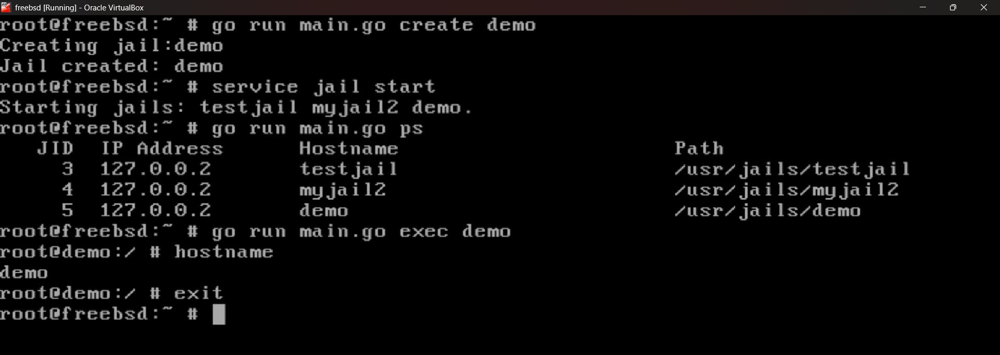

# FreeBSD Jail CLI (bsdctl)

A developer-friendly CLI tool to manage FreeBSD jails.

---

## 🚀 Features

- Create jails automatically
- Start and stop jails
- List running jails
- Execute commands inside jails (interactive shell)

---

## 🧠 Motivation

FreeBSD jails are powerful and lightweight, but managing them requires multiple manual steps and commands.

This project simplifies jail management by providing a clean CLI interface similar to modern container tools like Docker, making it easier for developers working with embedded systems, edge devices, and lightweight infrastructure.

---

## ⚙️ Usage

### Create a Jail

```bash
go run main.go create demo
```

### Start Jails

```bash
go run main.go start
```

### Stop Jails

```bash
go run main.go stop
```

### List Running Jails

```bash
go run main.go ps
```

### Execute Inside Jail

```bash
go run main.go exec demo
```

---

## 📸 Demo

Below is a demonstration of the CLI in action:



### Commands used:

```bash
go run main.go create demo
service jail start
go run main.go ps
go run main.go exec demo
```

---

## 🛠 Tech Stack

- Go (Golang)
- FreeBSD Jails

---

## 📌 Future Improvements

- Dynamic IP allocation for jails
- Jail templates and reusable configurations
- Logging and monitoring support
- Image-based jail creation (Docker-like workflow)
- Better error handling and validation

---

## 👨‍💻 Author

Chandrachud Siddharth